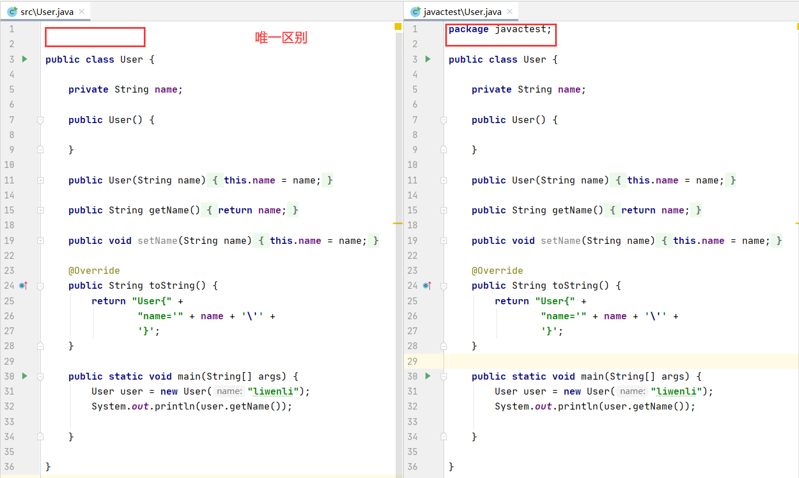
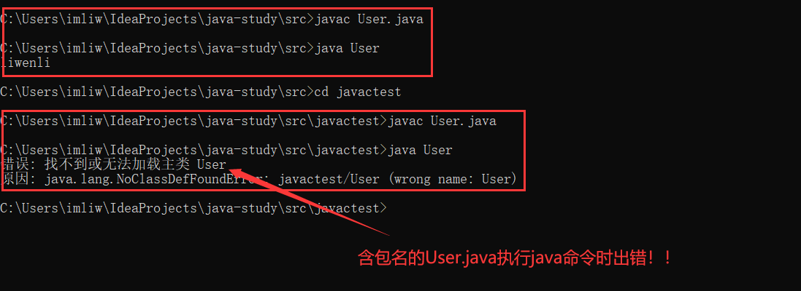
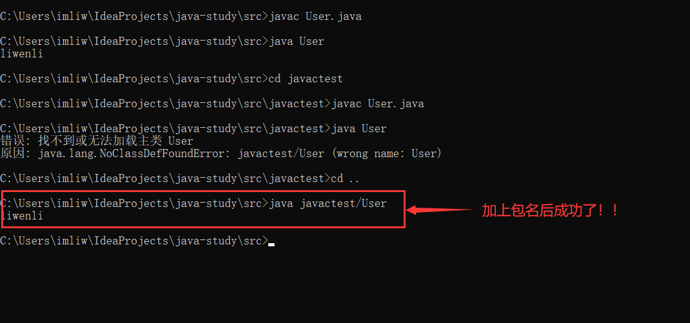

#java-notes

##常见错误

* 使用java命令运行class文件提示错误：“找不到或无法加载主类“的问题分析。
1.定义两个类
```
public class User {

    private String name;

    public User() {

    }

    public User(String name) {
        this.name = name;
    }

    public String getName() {
        return name;
    }

    public void setName(String name) {
        this.name = name;
    }

    @Override
    public String toString() {
        return "User{" +
                "name='" + name + '\'' +
                '}';
    }

    public static void main(String[] args) {
        User user = new User("liwenli");
        System.out.println(user.getName());

    }

}

```
```
package javactest;

public class User {

    private String name;

    public User() {

    }

    public User(String name) {
        this.name = name;
    }

    public String getName() {
        return name;
    }

    public void setName(String name) {
        this.name = name;
    }

    @Override
    public String toString() {
        return "User{" +
                "name='" + name + '\'' +
                '}';
    }

    public static void main(String[] args) {
        User user = new User("liwenli");
        System.out.println(user.getName());

    }

}

```



2.执行java命令


3.分析

大家再回去看看java的书籍就会发现，一个类的全名应该是包名+类名。



4.总结

总结

（1）java执行class文件是根据CLASSPATH指定的地方来找，不是我们理解当前目录。
如果希望它查询当前目录，需要在CLASSPATH中加入“.;”,代表当前目录。

（2）java执行class文件对package的路径是强依赖的。
它在执行的时候会严格以当前用户路径为基础，按照package指定的包路径转化为文件路径去搜索class文件。